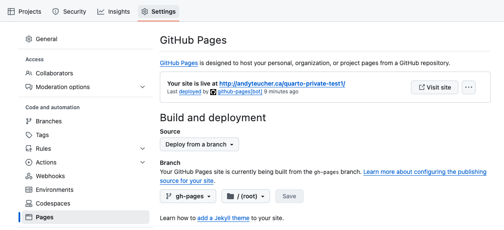
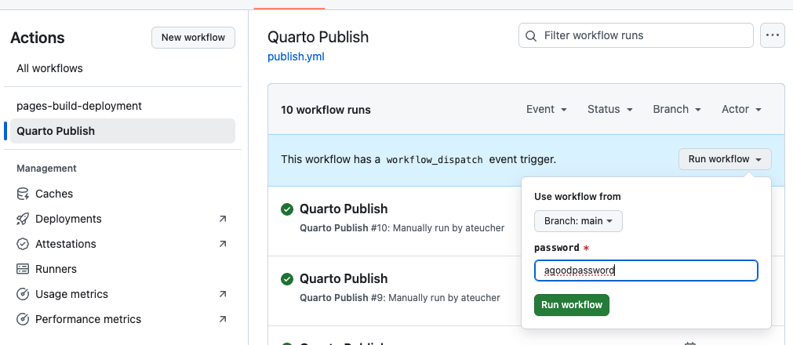

# Create a password-protected Quarto website

This is a Quarto website template with password protection, using the 
[staticryptR](https://github.com/nikitoshina/staticryptR) package.

This will encrypt the rendered website and put it behind a simple password
prompt. It does not encrypt the source files, they will still be visible if they
are in a public repository, so this is likely most useful if the source files
are in a private repository but GitHub pages is set to be public (e.g., for 
[GitHub Enterprise Cloud users](https://docs.github.com/en/enterprise-cloud@latest/pages/getting-started-with-github-pages/changing-the-visibility-of-your-github-pages-site)).

Using staticryptR requires Node and the [staticrypt](https://github.com/robinmoisson/staticrypt) 
Node library to be installed on your computer:

- Install [Node](https://nodejs.org/en/download) for your operating system.

In R:

- Install [staticryptR](https://github.com/nikitoshina/staticryptR)

    ```
    install.packages("staticryptR")
    ```

- Run the following to install the `staticrypt` Node library:

    ```
    staticrytR::install_staticrypt()
    ```

`encrypt.R` contains the script that will do the encryption. Set options in that
file. This script will be run automatically when the site is rendered - it is
specified in the `post-render` parameter in `_quarto.yml`.

This template renders and encrypts the site in the `gh-pages` branch via a
GitHub Action. To enable it, go to your repository on GitHub:

1. Click "Settings"
2. Click "Pages"
3. Under "Build and Deployment > Source", choose "Deploy from a branch"
4. Under "Branch" choose "gh-pages" and "/ (root)"



To render, encrypt, and deploy your site:

1. Go to the "Actions" tab in your repository.
2. In the left menu click the "Quarto Publish" action
3. Click the "Run Workflow" dropdown on the right, leave "branch" set to "main", 
enter a password for your site, and click "Run workflow"


